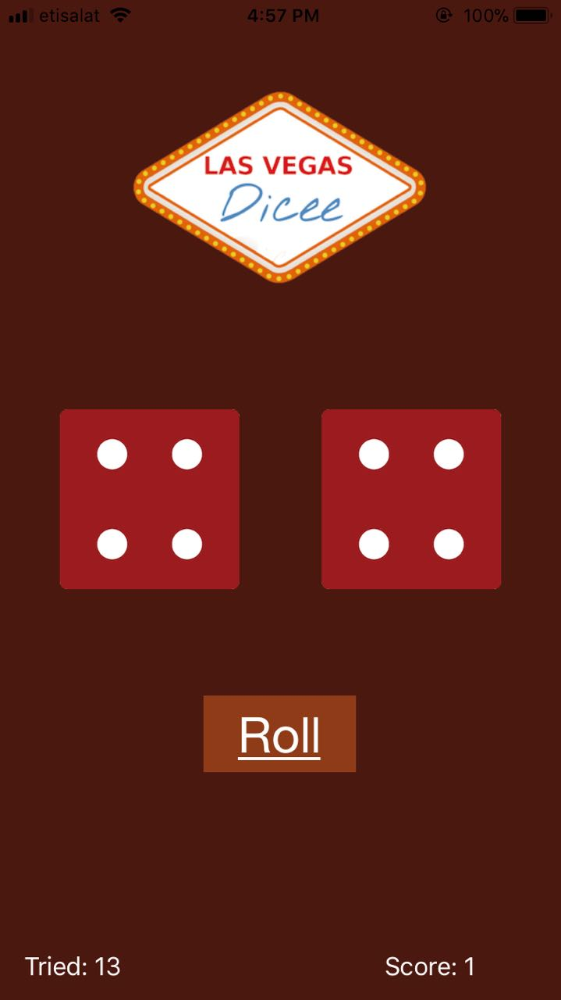
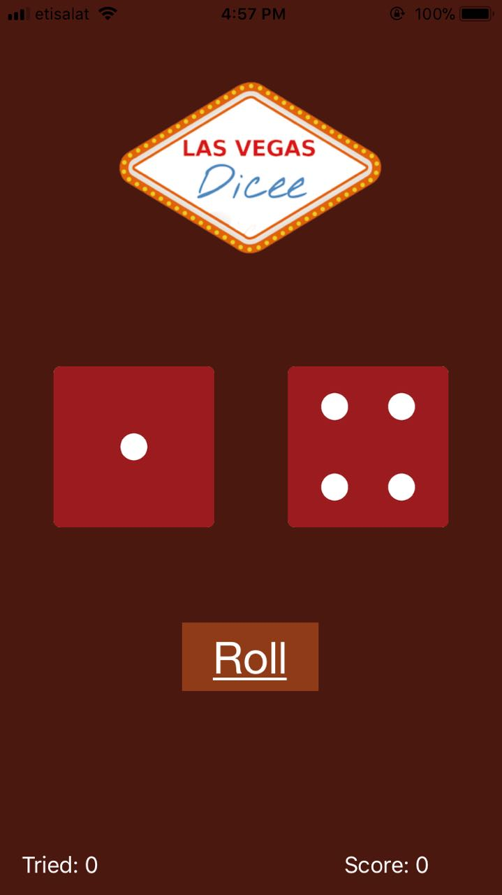
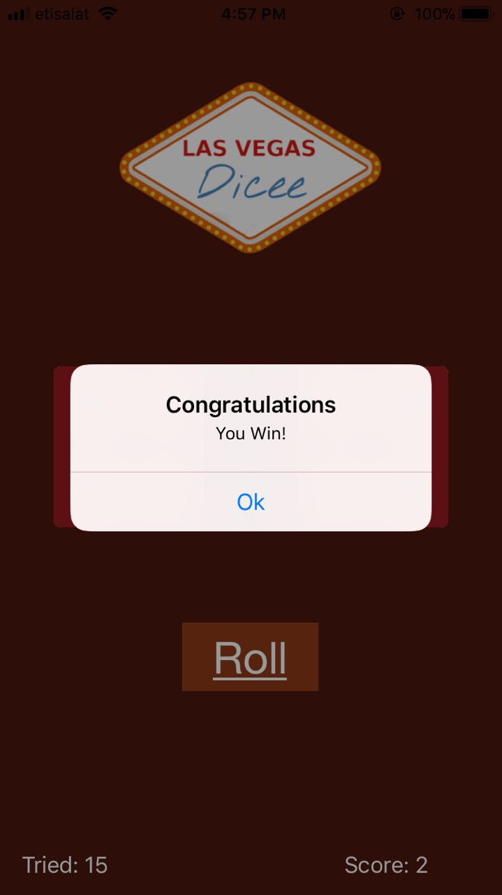

# Dice-App
Welcome to Dice open-source iOS app!

## Requirements to run the app on your iPhone
* iPhone 6/6s running iOS 11.2 or higher

* Mac running OS X 10.12 or later

## Screenshots of the App

  


## Installing the App on your iPhone for the first time
```
1- Install the latest version of Xcode.
2- open the project
3- Installing the app on your phone:
```
* Connect your iPhone to your computer.
* Select your iPhone from the "Scheme toolbar menu".
* Click the "Run" button.
* If an error occurs saying the Bundle Identifier is unavailable, change the Bundle Identifier to something unique in Xcode and try again please.
* Follow the instructions in the pop up windows i.e.:
* Click "Fix Issue".
* Enter in the username and password for your iCloud account.
* "Select a Development Team" i.e your own name.
* You will probably have to do that 7-8 times
* Unlock your phone so your Mac can install the app onto your phone.
* Trust your own developer on your iDevice under "Settings -> General -> Profile -> (your apple ID)"
* Do the happy dance! :-)
